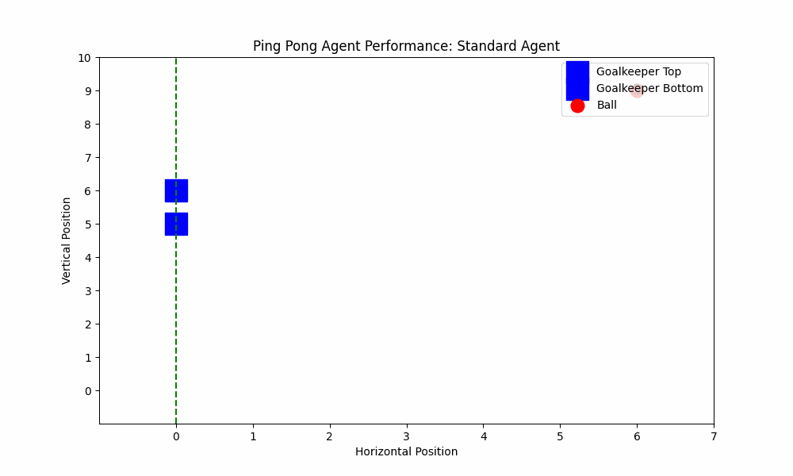
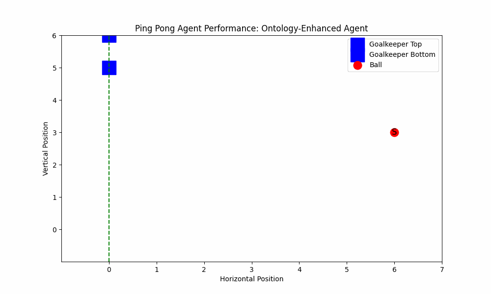
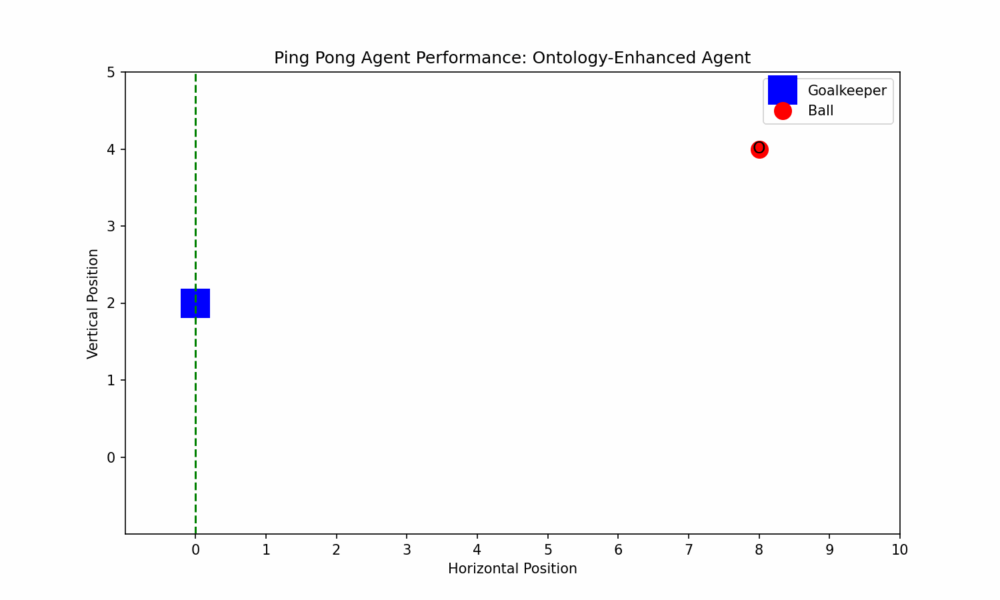

<<<<<<< HEAD
# Ontology-Enhanced Q-Learning for Ping Pong Simulation

<div align="center">
  
  
</div>
=======
# Ontology-Enhanced Reinforcement Learning for Goalkeeper Simulation

### Ontology-Enhanced Q-Learning Agent



## Table of Contents
- [Overview](#overview)
- [Features](#features)
- [Installation](#installation)
- [Usage](#usage)
- [Ontology Details](#ontology-details)
- [Project Structure](#project-structure)
- [Contributing](#contributing)
- [Acknowledgements](#acknowledgements)
>>>>>>> 85b60f02796c521d49612fdd95b49bb2e3724a5c

## Overview

This project implements a Q-Learning-based reinforcement learning agent to play a simplified Ping Pong game. It compares the performance of a standard Q-Learning agent with an ontology-enhanced agent, demonstrating how incorporating domain knowledge can improve learning efficiency and effectiveness.

## Features

<<<<<<< HEAD
- **Standard Q-Learning Agent:** Learns to intercept the ball without additional knowledge.
- **Ontology-Enhanced Agent:** Utilizes an ontology to understand the environment better, leading to improved performance.
- **Visualization:** Generates performance comparison plots and animated GIFs showcasing agent behaviors.
- **Logging:** Detailed logs for monitoring training and testing processes.
=======
- **Custom Gym Environment**: Simulates a goalkeeper scenario with vertical agent movement and horizontally moving balls.
- **Ontology Integration**: Uses OWL ontologies to provide agents with structured knowledge about the game entities.
- **Q-Learning Agents**: Implements both standard and ontology-enhanced Q-Learning agents.
- **Training and Comparison**: Scripts to train agents and compare their performances.
- **Visualization**: Generates animated GIFs to visualize agent behaviors during test episodes.
- **Extensible Design**: Modular codebase allowing for easy extensions and enhancements.

## Architecture

1. **Environment (`ping_pong_env.py`)**: Defines the game dynamics, agent and ball positions, actions, and rewards.
2. **Ontology (`ontology_definition.py`)**: Specifies the ontology structure using `owlready2`, defining properties like ball shape and speed.
3. **Agents**:
   - **Standard Agent (`q_learning_agent.py`)**: Basic Q-Learning implementation.
   - **Ontology-Enhanced Agent (`ontology_enhanced_agent.py`)**: Q-Learning agent utilizing ontology-derived knowledge.
4. **Training Script (`compare_agents.py`)**: Trains both agents and compares their performances.
5. **Visualization (`visualize_agents.py`)**: Creates animations of agent behaviors and exports them as GIFs.
>>>>>>> 85b60f02796c521d49612fdd95b49bb2e3724a5c

## Installation

1. **Clone the Repository:**
   ```bash
   git clone https://github.com/yourusername/onto_rl.git
   cd onto_rl
   ```

2. **Create a Virtual Environment:**
   ```bash
   python -m venv env
   source env/bin/activate  # On Windows: env\Scripts\activate
   ```

3. **Install Dependencies:**
   ```bash
   pip install -r requirements.txt
   ```

## Usage

1. **Train Agents:**
   ```bash
   python main.py
   ```

   This will train both the standard and ontology-enhanced agents, generate performance plots, save Q-tables, and create animated GIFs of test episodes.

2. **View Results:**
   - **Performance Plots:** Located in the `assets` directory as `agent_performance_comparison.png`.
   - **Animated GIFs:** Located in the `assets` directory as `standard_agent_performance.gif` and `ontology_agent_performance.gif`.
   - **Q-Tables:** Saved in the `models` directory.

## Project Structure

```
onto_rl/
├── assets/
│   ├── agent_performance_comparison.png
│   ├── standard_agent_performance.gif
│   └── ontology_agent_performance.gif
├── models/
│   ├── standard_agent_qtable.pkl
│   └── ontology_agent_qtable.pkl
├── ontology/
│   └── pingpong.owl
├── src/
│   ├── ping_pong_env.py
│   ├── q_learning_agent.py
│   ├── ontology_enhanced_agent.py
│   └── visualize_agents.py
├── config.yaml
├── main.py
├── requirements.txt
└── README.md
```

## Dependencies

- Python 3.7+
- `gym`
- `numpy`
- `matplotlib`
- `owlready2`
- `PyYAML`
- `Pillow`

Install all dependencies using:
```bash
pip install -r requirements.txt
```

## Configuration

Modify the `config.yaml` file to adjust parameters such as grid size, number of episodes, paths for saving models and assets, and moving average window size.

```yaml
# config.yaml

grid_size: 10
episodes: 2000
test_episodes: 5
moving_average_window: 100

# Paths
paths:
  ontology: "./ontology/pingpong.owl"
  models: "./models"
  assets: "./assets"
  logs: "./logs"
```

## Logging

Logs are saved to `onto_rl.log` in the "ontology/" directory, providing detailed information about the training and testing processes.

<<<<<<< HEAD
```
=======

## Acknowledgements

- **OpenAI Gym**: For providing the RL environment framework.
- **Matplotlib**: For visualization and animation capabilities.
- **OWLReady2**: For ontology management in Python.
- **Pillow**: For image processing and GIF creation.

---
```
>>>>>>> 85b60f02796c521d49612fdd95b49bb2e3724a5c
